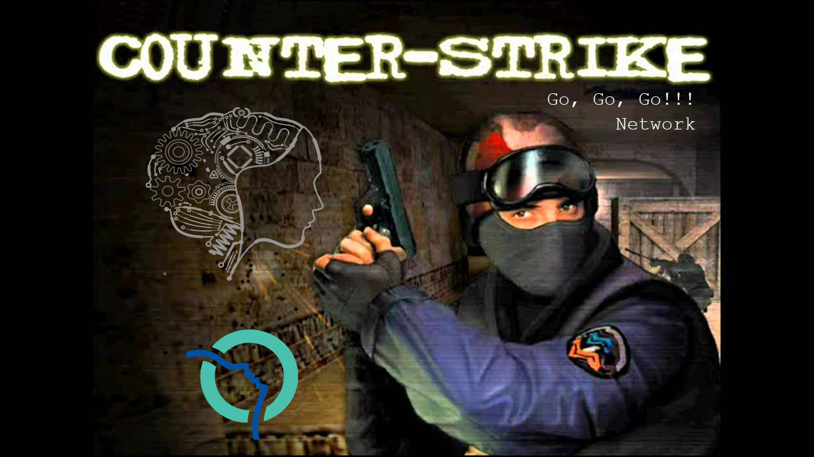

# Player World XYZ Coordinates Regression
### Step 1 - Find source files
I retrieved a set of `dem` files and their associated `vod` video from `hltv`. Each broadcaster (e.g. ESL, 9to5) has its own UI layout, si I retrieve one game on each map usually played. One broadcaster will be kept aside for testing, the goal being to generalize to unknown UI layouts. One map of each caster will also be kept for testing (e.g. dust2 for ESL, inferno for 9to5). The network will not be able to generalize to unknown maps.

I downloaded the `twitch` videos using `Twitch Leecher`.

### Step 2 - Convert `dem` to `json`
Using `node` and the `DemoFile` library I've extracted just what I needed from the `dem` files, i.e. player coordinates, player aliveness, and some events. See [json_of_dem.js](json_of_dem.js).

To assert the validity of the extracted player coordinates I plotted those with matplotlib in 3d. See [plot_json.py](plot_json.py).

### Step 3 - Time Co-Registration
Aligning the time of a `vod` file with its `dem` counterpart is not a straighforward task for several reasons:
- Most events are hard to precisely locate on the `vod`.
- The `vod` often looses the focus to show things like kill cams or people's faces.
- Small differences of flow rate between the two. e.g. a match being 4800sec long on the `vod` and 4803sec long on the `dem`.
- Commercial breaks between rounds not reflected in the `dem` file.

I found `end of buy phase`, `bomb planted`, `bomb exploded` and `bomb defused` to be event that can be very precisely timed on the `vod`. Things like `begining of buy phase` or `player death` don't have clear visual clues.

For each `game` I tracked down the `vod` timestamp of ~3 events per game (using `Avidemux`) that serve as `claps` to allow for the linear interpolation (and extrapolation) any timestamps of the `game`. More timestamps are necessary to handle the commercial breaks. See [constants.py](constants.py)

I empirically estimated the maximum drift to be <0.1 sec using [plot_time_coregistration.py](plot_time_coregistration.py).

### Step 4 - Minimap Co-Registration
A brave data-scientist would directly regress the player's coordinates and not need more data. I instead chose to be safe by manually registering the `dem` x/y coordinates with the `vod` i/j coordinates in order to also train the network to locate the minimap icons.

It is not necessary to perfectly align the coordinates because the network will be able to learn a correction, but it is crutial to reproduce the same alignment errors from one stream to another because the network will __not__ be able to learn a correction per UI layout.

The stylish `vod` that use 2 minimaps to represent the different floors on `vertigo` or `nuke` are have not been co-registered and haven't been supervised on this task. The task of locating the circles is learnt from the other streams and generalizes well to the multi-minimap `vod`. (TODO: Check)

