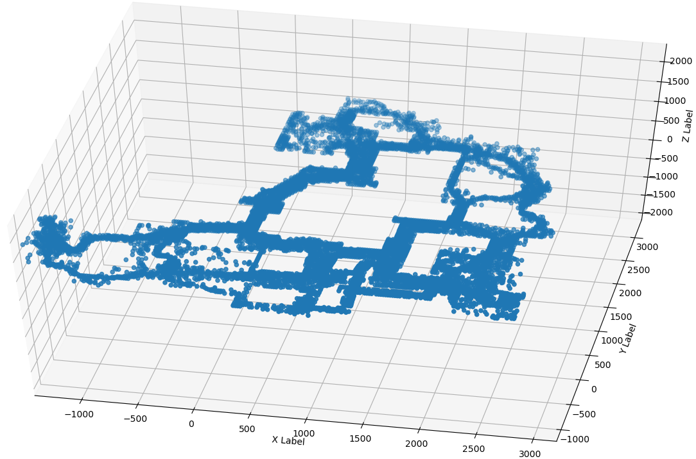

# Go, Go, Go!!! Network

TODO: Sum of the goals of the network

## Player World XYZ Coordinates Regression
#### Step 1 - Find source files
My base data are pairs of `dem` files and their associated `vod`. The `vod` file is a regular video, the `dem` file is a counter strike `Demo File` that contains all in-game events of a game. Such pairs can be found on `hltv.org`.

Each broadcaster (e.g. ESL, 9to5) has its own UI layout (a.k.a. overlay) so I retrieved one game per broadcaster on each map usually played.

One broadcaster will be kept aside for testing - the goal being to generalize to unknown UI layouts. One map of each broadcaster will also be kept for testing (e.g. dust2 for ESL, inferno for 9to5). The network will not be able to generalise to unknown maps.

I downloaded the `twitch` videos using `Twitch Leecher`.

#### Step 2 - Convert `dem` to `json`
Using `node` and the `DemoFile` library I've extracted just what I needed from the `dem` files, i.e. player coordinates, player aliveness, and some events. See [json_of_dem.js](json_of_dem.js).

To assert the validity of the extracted player coordinates I plotted those with matplotlib in 3d. See [plot_json.py](plot_json.py).

inferno:


#### Step 3 - Time Co-Registration
Aligning the time of a `vod` file with its `dem` counterpart is not a straighforward task for several reasons:
- Most events are hard to precisely locate on the `vod` because the overlay is most of the time out of sync from the action on screen.
- The `vod` often looses the focus to show things like kill cams or people's faces.
- Small differences of flow rate between the two. e.g. a match being 4800sec long on the `vod` and 4803sec long on the `dem`.
- Commercial breaks between rounds not reflected in the `dem` file.
- Technical problems on the `vod`
- The `dem` files can start too late (or stop too soon) and miss the beginning (or the end) of a game.

I found `end of buy phase`, `bomb planted`, `bomb exploded` and `bomb defused` to be the easiest events to tag on a `vod`. Things like `begining of buy phase` or `player death` don't have clear visual clues.

For each `game` I tracked down the `vod` timestamp of >=3 events per game (using `Avidemux`) that serve as `claps` to allow for the linear interpolation (and extrapolation) any timestamp of the `game`. More timestamps are necessary to handle the commercial breaks. See [constants.py](constants.py).

##### [plot_time_coregistration.py](plot_time_coregistration.py)
Using this script I can check the validity of the co-registration on the events that I havent manually tagged.

##### [test_time_coregistration.py](test_time_coregistration.py)
Using this script I can check the quality of the co-registration by comparing a `clap` manually tagged against its estimation from the other `claps` in the game. This process allows the detection of missing breaks, and helps deciding if there are enough `claps` in the game.

For exemple, on `2343922_gambit-youngsters-vs-sprout-nine-to-five-4` / `vertigo` I had to add one `clap` to keep the drift below 100ms.

before
```
   idx                        ev  round_idx         tdem      tvod    tvod_pred   error
0    0  round_first_displacement          2   228.562500  6584.768  6584.725820  -0.042
1    1  round_first_displacement         11  1367.648438  7724.268  7724.288210  +0.020
2    2  round_first_displacement         19  2415.468750  8772.508  8772.559314  +0.051
3    3  round_first_displacement         28  3540.171875  9897.768  9897.661607  -0.106
```

after
```
   idx                        ev  round_idx         tdem      tvod    tvod_pred   error
0    0  round_first_displacement          2   228.562500  6584.768  6584.725820  -0.042
1    1  round_first_displacement         11  1367.648438  7724.268  7724.288210  +0.020
2    2  round_first_displacement         19  2415.468750  8772.508  8772.552307  +0.044
3    3  round_first_displacement         25  3117.093750  9474.488  9474.480396  -0.008
4    4  round_first_displacement         28  3540.171875  9897.768  9897.780189  +0.012
```

#### Step 4 - Minimap Co-Registration

TODO: Aligning minimap and aligning the dots serve 2 different purposes

A brave data-scientist would directly regress the player's coordinates and not need more data. I instead chose to be safe by manually registering the `dem` x/y coordinates with the `vod` i/j coordinates in order to also train the network to locate the minimap icons.

It is not necessary to perfectly align the coordinates because the network will be able to learn a correction, but it is crutial to reproduce the same alignment errors from one stream to another because the network will __not__ be able to learn a correction per UI layout.

The stylish `vods` that use 2 minimaps to represent the different floors on `vertigo` or `nuke` are have not been co-registered and haven't been supervised on this task. The task of locating the circles is learnt on the other streams and it generalizes well to the multi-minimap `vods`. (TODO: Check)

---

---


