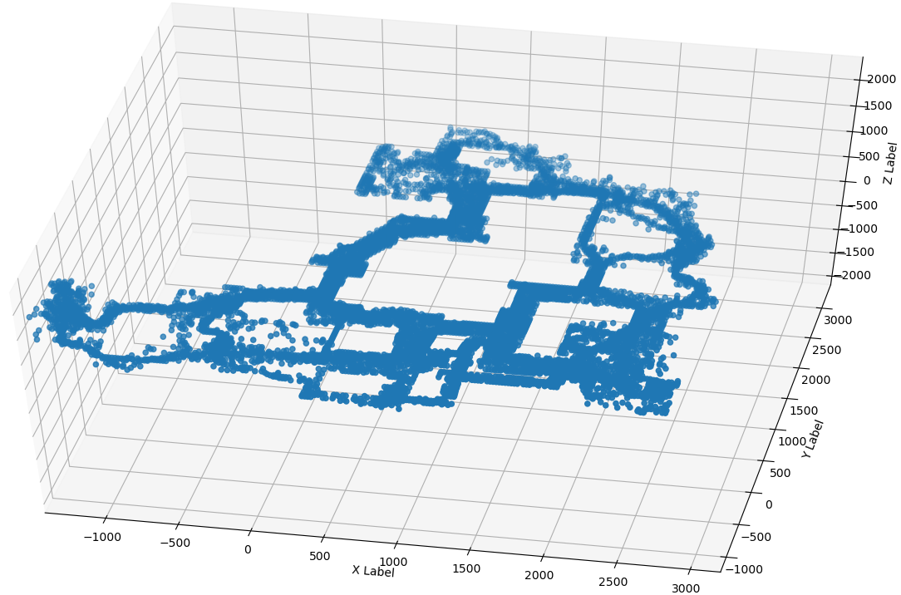
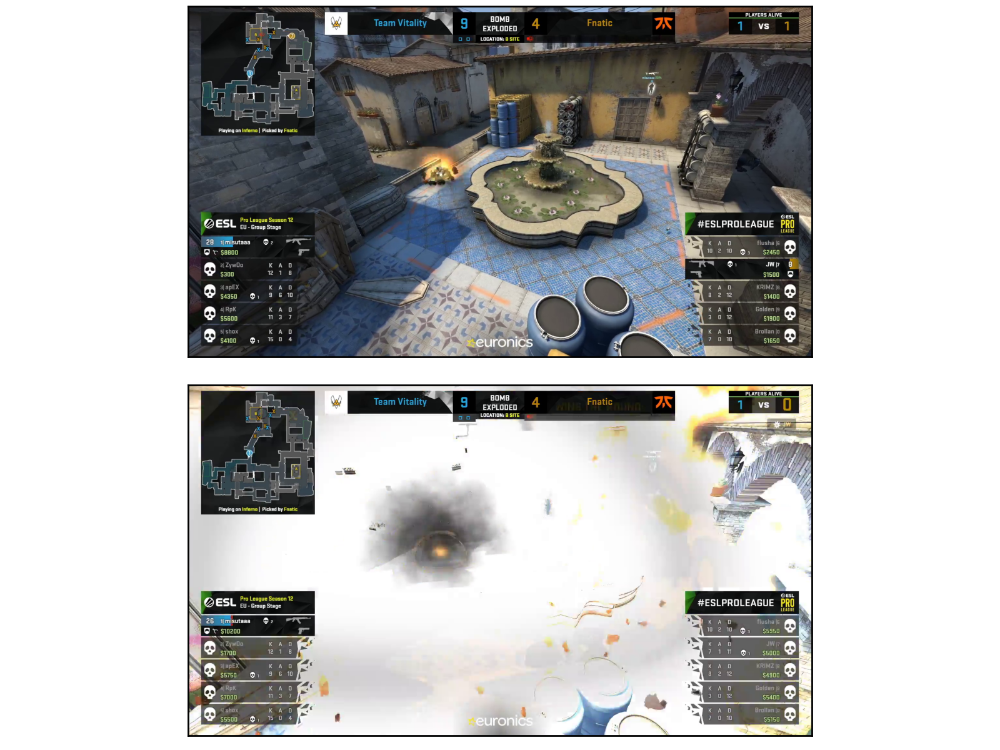
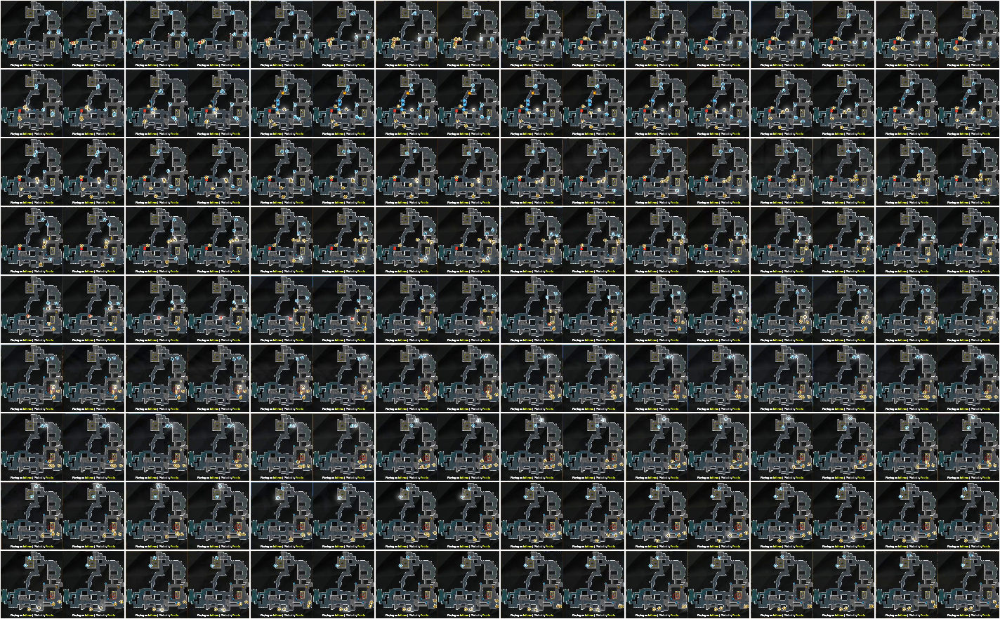
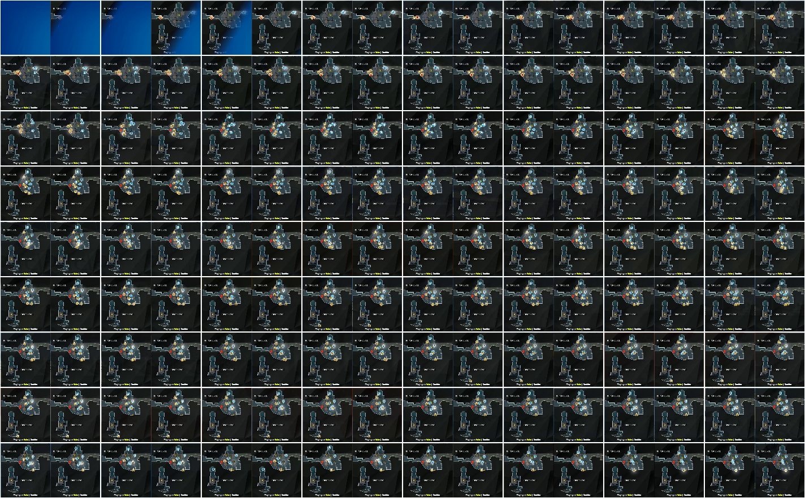
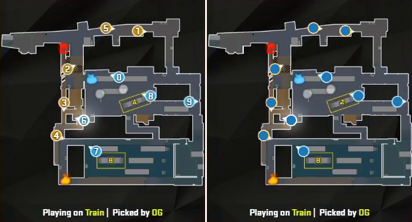
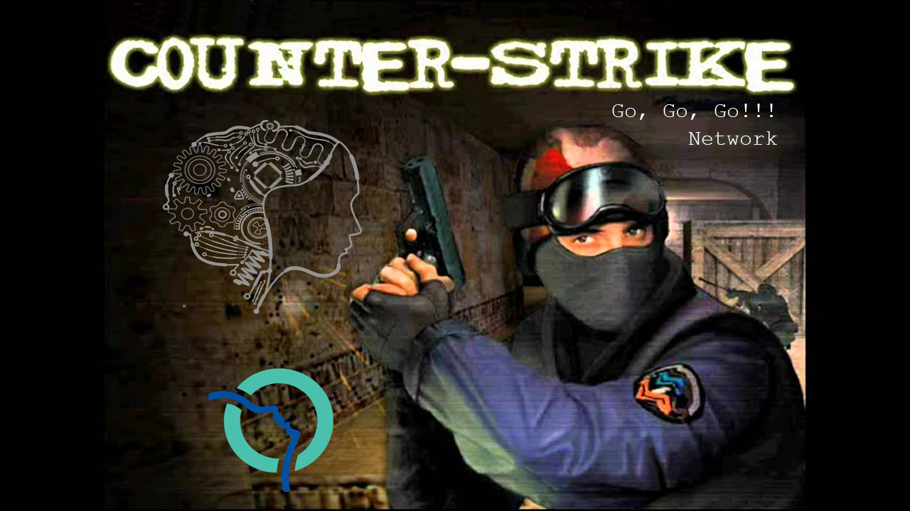

# Go, Go, Go!!! Network

This project is an attempt to transpose this
[medium article](https://medium.com/pandascore-stories/league-of-legends-getting-champion-coordinates-from-the-minimap-using-deep-learning-48a49d35bb74)
from `LOL` to `csgo` in the task of guessing the players' coordinates by only looking at the minimap in an esport video stream.

With more word: the goal is to create a program being able to ingest a live video stream of a `csgo` competition,
produce an xyz coordinate for each player alive,
on all frames where the minimap is visible,
on a fixed set of `csgo` maps and
on any UI layouts, even the ones not trained for.

Additionally the network will be in charge of saying whether or not a minimap is visible. The reason is a bit convoluted:
Since the players may overlap each other on the minimap, a prediction may require informations from previous frames.
This implies that a _sequence model_ is needed
and since such a model requires an initial _hidden state_ for the initial frame where the minimap appears (or reappears).
The act of _resetting_ the _hidden state_ when the minimap reappears has to be automated within the program, hence the minimap visibility prediction.
(TODO: What if I let the LSTM solve this problem?)

Additionally the network will be in charge of saying where the minimap is (if any).
This will be useful to reduce the number of convolutions by focusing where the minimap has been located.
(TODO: What about feeding only the minimap to the LSTM?)

---

# Creation Process
## Step 1 - Download sources for training
My base data are `dem` files and their associated `vod`.
A `vod` file is a regular video (a replay of a stream) and
a `dem` file is a counter-strike `Demo File` that contains all in-game events of a game. Such pairs can be found at `hltv.org`.

Each broadcaster (e.g. ESL, 9to5) has its own UI layout (a.k.a. overlay) so I retrieved one game per map for several broadcasters.

One broadcaster will be kept aside for testing - the goal being to generalize to unknown UI layouts. One map of each broadcaster will also be kept for testing (e.g. dust2 for ESL, inferno for 9to5). The network will not be able to generalise to unknown maps.

I downloaded the `twitch` videos using `Twitch Leecher`.

---

## Step 2 - Convert `dem` to `json`
`dem` files do not support random access so i've partially converted those to json using `node` and the `DemoFile` library.
I've extracted just what I needed, i.e. players live coordinates, players aliveness, and some events. See [json_of_dem.js](json_of_dem.js).
(TODO: Players' death (what is event `other_death`?))
(TODO: Players' index)

To assert the validity of the extracted player coordinates I plotted those with matplotlib in 3d. See [show_json.py](show_json.py).

> inferno


---

## Step 3 - Time Co-Registration
The `vod`/`dem` pairs have to be synchronized before any training, which is not a straighforward task for several reasons:
- Most events are hard to precisely locate on the `vod`.
- The overlay is most of the time out of sync by a few frames from the action on screen.
- The `vod` often looses the focus to show things like kill cams or people's faces.
- There are small differences of flow rate between the `vod` and the `dem` (e.g. a match being 4800s long on the `vod` and 4803s long on the `dem`).
- The `dem` files have a difference frame rate than the `vod` files. 128 fps vs 60 fps most of the time.
- Some breaks between rounds are not reflected in the `dem` file.
- Rare technical problems on the `vod`.
- The `dem` files can start too late (or stop too soon) and miss the beginning (or the end) of a game.
- Technical subtlties of video files.

For each `game` I tracked down the `vod` timestamp of ≥3 events per game (using `Avidemux`) that serve as `claps` to allow for the linear interpolation (and extrapolation) of any timestamp of the `game`. See [constants.py](constants.py).

I found `end of frozen phase`, `bomb planted`, `bomb exploded` and `bomb defused` to be the easiest events to tag on a `vod`. Things like `begining of frozen phase` or `player death` don't have clear visual clues.

Manually reaching a frame-perfect co-registration is impossible, so I will still have to be careful about some details like players death or players disconnection and their disapearance from the minimap.

### Script: [plot_time_coregistration.py](plot_time_coregistration.py)
Using this script I can check the validity of the co-registration on the events that I haven't manually tagged.

> On top, a `vod` at an event `bomb_exploded` that wasn't manually labelled but that was calculated from the `claps`. Below the same `vod` 150ms later.


### Script: [test_time_coregistration.py](test_time_coregistration.py)
Using this script I can check the quality of the co-registration by comparing a `clap` manually tagged against its estimation from the other `claps` in the game.
This process allows for the detection of missing breaks, and helps deciding if there are enough `claps` in the game.

For exemple, on `2343922_gambit-youngsters-vs-sprout-nine-to-five-4`/`vertigo` I had to add one `clap` to keep the drift below 100ms:

- Before:
```
   idx                        ev  round_idx         tdem      tvod    tvod_pred   error
0    0  round_first_displacement          2   228.562500  6584.768  6584.725820  -0.042
1    1  round_first_displacement         11  1367.648438  7724.268  7724.288210  +0.020
2    2  round_first_displacement         19  2415.468750  8772.508  8772.559314  +0.051
3    3  round_first_displacement         28  3540.171875  9897.768  9897.661607  -0.106
```

- After:
```
   idx                        ev  round_idx         tdem      tvod    tvod_pred   error
0    0  round_first_displacement          2   228.562500  6584.768  6584.725820  -0.042
1    1  round_first_displacement         11  1367.648438  7724.268  7724.288210  +0.020
2    2  round_first_displacement         19  2415.468750  8772.508  8772.552307  +0.044
3    3  round_first_displacement         25  3117.093750  9474.488  9474.480396  -0.008
4    4  round_first_displacement         28  3540.171875  9897.768  9897.780189  +0.012
```

See `How precise should be the clicks?` in `Step 4.2` for a reasoning about labelling errors in centimeter.
A similar argument can be made about labelling error in seconds.

---

## Step 4 - Minimap Co-Registration
A brave data-scientist would directly regress the player's coordinates and not need more data.
I instead chose to be safe by manually registering the `dem` x/y coordinates with the `vod` i/j coordinates
in order to also train the network on intermediate tasks like locating the minimap icons or recognising the minimap background.

Synchonising the minimap has two aspects:
1. Identifing the segments where the minimap is not hidden or occluded by the broadcaster.
2. For each map and each overlay, computing the transformation matrix from world x/y coordinates to screen i/j coordinates.

### Step 4.1 - Select segments where the minimap isn't occluded
Watching the full replays and tagging one by one the millions of frames is not an option.

My strategy was to chop each game by rounds (from `freeze_end` to `round_end` events) and compute a visual summary of the corner of the screen where the minimap is supposed to be. See [plot_minimap_occlusions.py](plot_minimap_occlusions.py) for more details.

> During this round on `overpass` the minimap stays visible.


> During this round on `nuke` the minimap is not visible at the beginning.


There is no (strong) need to train on segments with a hidden minimap because of the shift invariance of the network.

### Step 4.2 - Manually register the world's coordinates with the minimap
Without an access to the source code of the overlays this has to be done with manual annotations.

A strategy would have been to locate static elements and point them on the minimap,
but I instead chose to take advantage of the time co-registration to correlate the players' coordinates from the `dem` files
with the location of their icons on the minimap.

Minimap icons are circles but because of the rasterization, the antialiasing and the video compression it is hard to precisely locate the center.

The most efficient method I found was to manually fit a disk using `QGis` and then to retrieve the centroid of the disk. I then used some linear algebra to compute the shift and scale coefficients that encode the coordinate system conversions. See [plot_minimap_coregistration.py](plot_minimap_coregistration.py) for more details.

> My annotations of `train` for the `ESL` overlay.
> On this exemple the transformation from i/j to x/y is `([j, -i] - [223.27, 192.41]) / 0.07826`. A pixel is 12.77 unit large.


#### How precise should be the clicks?
When manually fitting the disks if feels like the maximum error is between ½ and 1 pixel.

If my click imprecisions follow a gaussian, the network will know how to generalise but it may slow down the training and lead to coarse decision boundaries.

If my clicks are all skewed in the same direction, the network predicting the icons' location will be fooled but the one converting to world coordinates will learn to shift accordingly. (TODO: I'm still unsure what method to use to implement the unit conversion in the network).

Let's convert the problem into tangible units.
A player runs at 250 world-unit per second (with a knife in hand), and a minimap pixel has a size of 10 to 15 world-units.
If `250 unit/s == 9 km/h` then `250 unit/s = 2.5 m/s` then `1 unit = 1 cm` then `10cm ≤ 1 minimap-pixel ≤ 15cm`.

A `10 cm` (`1 minimap-pixel`) error in `csgo` is a certain death for a professional player but it is most acceptable for the task as hand.

### WIP on step4

The stylish `vods` that use 2 minimaps to represent the different floors on `vertigo` or `nuke` are have not been co-registered and haven't been supervised on this task. The task of locating the circles is learnt on the other streams and it generalizes well to the multi-minimap `vods`. (TODO: Check)

TODO: Aligning minimap drawings and aligning the dots serve 2 different purposes
TODO: ADD CLAPS AROUND THOSE FRAMES

---

## Step 5 - Not-So-Deep Neural Network

TODO: Receptive field needed

TODO: Augmentation is not needed because of the lack of data (O bet I will do less than 1 epoch) but because I want to generalize to all overlays.

TODO: Shift augmentation to avoid overfit of deepest kernels on overlay elements that never move

TODO: What about non-discrete augmentation? Scale minimap, <1 shifts

TODO: introduce `convnet` and `seqnet` and the shared hidden state

TODO: How to pass shared hidden state to `seqnet` ? conv and Global max pooling ?

TODO: What tasks should and should not be performed by `convnet`, same for `seqnet`

TODO: How many training step? 1 might not be possible. Training the `seqnet` after might allow the precomputation of the shared hidden state.

TODO: Which set weights are specialized for one maps? Some meta-learning magic?

TODO: Should the `seqnet` have any concept of elevation?

TODO: Some triplet loss magic to enforce some constraints of the SHS or the conv kernel? (Could constrain conv some weights to be similar, per-map)

Supervision ideas for `convnet`:
- player count in "super" pixels for each stride, directly from shared hidden state
- predict vector and proba, directly from shared hidden state, for each large-pixel, for each index. But kill loss (or grad) if one of the pred cannot be made.
- a mask-rcnn like instanciation
- the z histogram history of players, for eachs stride, for each pixel

Ideas for `seqnet`:
- euh


## Step 6 - Performance analysis and ideas for improvement


---

---


