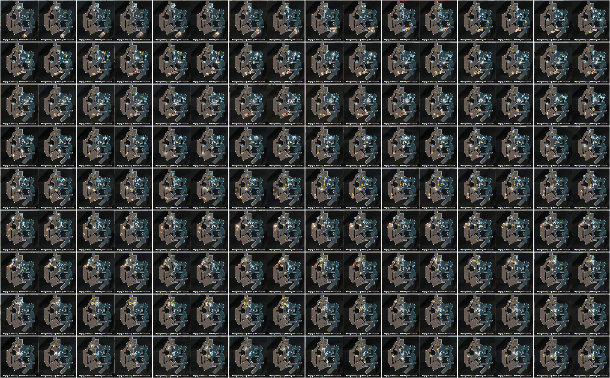

# Go, Go, Go!!! Network

This project is an attempt to transpose this
[medium article](https://medium.com/pandascore-stories/league-of-legends-getting-champion-coordinates-from-the-minimap-using-deep-learning-48a49d35bb74)
from `lol` to `csgo` in the task of guessing the player's coordinates by only looking at the minimap in an esport video stream.

With more word: the goal is to create a program being able to ingest a live video stream of a `csgo` competition,
produce the xyz coordinates for each player alive,
on all frames where the minimap is visible,
on a fixed set of `csgo` maps and
on any UI layouts, even the ones not trained for.

Additionally the network will be in charge of saying whether or not a minimap is visible and also saying where the minimap is (if any).

This program will be especially useful in the situations where the access to the stream of events from the `csgo` server is not available.

---

# Creation Process
## Step 1 - Download sources for training
My base data are `dem` files and their associated `vod`.
A `vod` file is a regular video (a replay of a stream) and
a `dem` file is a counter-strike `Demo File` that contains all in-game events of a game. Such pairs can be found at `hltv.org`.

Each broadcaster (e.g. ESL, 9to5) has its own UI layout (a.k.a. overlay) so I retrieved one game per map for several broadcasters.

I downloaded the `twitch` videos using `Twitch Leecher`.

---

## Step 2 - Convert `dem` to `json`
`dem` files do not support random accesses so I partially converted those to json using `node` and the `DemoFile` library.
I've extracted just what I needed, i.e. players live coordinates, players death, and some events. See [json_of_dem.js](json_of_dem.js).

To ascertain the validity of the extracted player coordinates I plotted those with matplotlib in 3d. See [show_json.py](show_json.py).

> inferno


---

## Step 3 - Time Co-Registration
The `vod`/`dem` pairs have to be synchronized before any training, which is not a straightforward task for several reasons:
- Most events are hard to precisely locate on the `vod`.
- The overlay is most of the time out of sync by a few frames from the action on screen.
- The `vod` often looses the focus to show things like kill cams or people's faces.
- There are small differences of flow rate between the `vod` and the `dem` (e.g. a match being 4800s long on the `vod` and 4803s long on the `dem`).
- The `dem` files have a different frame rate than the `vod` files. 128 fps vs 60 fps most of the time.
- Some breaks between rounds are not reflected in the `dem` file.
- Rare technical problems on the `vod`.
- The `dem` files can start too late (or stop too soon) and miss the beginning (or the end) of a game.
- Technical subtleties of video files.

For each `game` I tracked down the `vod` timestamp of ≥3 events per game (using `Avidemux`) that serve as `claps` to allow for the linear interpolation (and extrapolation) of any timestamp of the `game`. See [constants.py](constants.py).

I found `end of frozen phase` to be the easiest event to tag on a `vod`. Things like `beginning of frozen phase` or `player death` don't have clear visual clues.

Manually reaching a frame-perfect co-registration is impossible, so I will still have to be careful about some details like players death or players disconnection and their disappearance from the minimap.

### Script: [plot_time_coregistration.py](plot_time_coregistration.py)
Using this script I can ascertain the validity of the co-registration of the events that I haven't manually tagged.

> First image: a `vod` at an event `bomb_exploded` that wasn't manually labelled, but that was calculated from the `claps`. <br/>
> Second image: The same `vod` but 150ms later.


### Script: [test_time_coregistration.py](test_time_coregistration.py)
Using this script I can ascertain the quality of the co-registration by comparing a `clap` manually tagged against its estimation from the other `claps` in the game.
This process allows for the detection of missing breaks, and helps deciding if there are enough `claps` in a game.

For example, on `2343922_gambit-youngsters-vs-sprout-nine-to-five-4`/`vertigo` I had to add one `clap` to keep the drift below 100ms:

- Before:
```
   idx                        ev  round_idx         tdem      tvod    tvod_pred   error
0    0  round_first_displacement          2   228.562500  6584.768  6584.725820  -0.042
1    1  round_first_displacement         11  1367.648438  7724.268  7724.288210  +0.020
2    2  round_first_displacement         19  2415.468750  8772.508  8772.559314  +0.051
3    3  round_first_displacement         28  3540.171875  9897.768  9897.661607  -0.106
```

- After:
```
   idx                        ev  round_idx         tdem      tvod    tvod_pred   error
0    0  round_first_displacement          2   228.562500  6584.768  6584.725820  -0.042
1    1  round_first_displacement         11  1367.648438  7724.268  7724.288210  +0.020
2    2  round_first_displacement         19  2415.468750  8772.508  8772.552307  +0.044
3    3  round_first_displacement         25  3117.093750  9474.488  9474.480396  -0.008
4    4  round_first_displacement         28  3540.171875  9897.768  9897.780189  +0.012
```

---

## Step 4 - Minimap Co-Registration
A brave data-scientist would directly regress the player's coordinates and not need more data.
I instead chose to be safe by manually registering the `dem` x/y coordinates with the `vod` i/j coordinates
in order to also train the network on intermediate tasks like locating the minimap icons or recognising the minimap background.

Synchronising the minimap has two aspects:
1. Identify the segments where the minimap is not hidden or occluded by the broadcaster.
2. For each map and each overlay, compute the transformation matrix from world x/y coordinates to screen i/j coordinates.

### Step 4.1 - Select segments where the minimap isn't occluded
Watching the full replays and tagging one by one the millions of frames is not an option.

My strategy was to chop each game by rounds (from `freeze_end` to `round_end` events) and compute a visual summary of the corner of the screen where the minimap is supposed to be. See [plot_minimap_occlusions.py](plot_minimap_occlusions.py) for more details.

> During this round on `overpass` the minimap stays visible.


> During this round on `nuke` the minimap is not visible at the beginning.


### Step 4.2 - Manually register the world coordinates with the minimap
Without an access to the source code of the overlays this has to be done with manual annotations.

I chose to take advantage of the time co-registration to correlate the player's coordinates from the `dem` files
with the location of their icons on the minimap.

Minimap icons are circles but because of the rasterization, the anti-aliasing and the video compression it is hard to precisely locate the center.

The most efficient method I found was to manually fit a disk using `QGis` and then to retrieve the centroid of the disk. I then used some linear algebra to compute the shift and scale coefficients that encode the coordinate system conversions.
See [plot_minimap_coregistration.py](plot_minimap_coregistration.py) for more details.

> My annotations of `train` for the `ESL` overlay. <br/>
> In this example the transformation from i/j to x/y is `([j, -i] - [223.27, 192.41]) / 0.07826`. <br/>
> A pixel is 12.77 unit large.


---

## Step 5 - Not-So-Deep Neural Network

## Step 6 - Performance analysis and ideas for improvement

---

---


